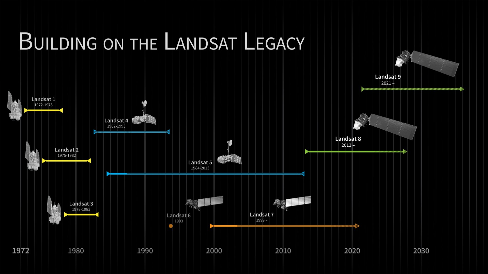

background-image: url("https://raw.githubusercontent.com/Ty-Chenn/RM_diary/main/Landsat1.png")
background-size: contain

<div style="text-align: center; margin-top: 40px; color: black;">
  <strong>Website:</strong> 
  <a href="https://science.nasa.gov/mission/landsat/" style="color: black; text-decoration: underline;">Landsat</a>
</div>
      
---
class: inverse, center, middle

# What is Landsat?

The Landsat programme is jointly managed by NASA and the United States Geological Survey (USGS), with continuous data collection dating back to 1972.

 


---

class: inverse, center, middle
- The primary objective of Landsat is to systematically observe the Earth’s land surface and provide consistent.Due to its long temporal coverage and global availability, Landsat data have become a foundational resource in remote sensing research.


# Explore more!
# See how they differ below


---

<div style="text-align: center;">
```{r, landsat-table, echo = FALSE, warning=FALSE}

library(knitr)

landsat <- data.frame(
  Satellite = c("Landsat 1","Landsat 2","Landsat 3","Landsat 4","Landsat 5",
                "Landsat 6","Landsat 7","Landsat 8","Landsat 9"),
  `Launch Year` = c(1972,1975,1978,1982,1984,1993,1999,2013,2021),
  `Main Sensor` = c("MSS","MSS","MSS","TM","TM","ETM","ETM+","OLI/TIRS","OLI-2/TIRS-2"),
  `Spatial Resolution` = c("60–80 m","60–80 m","60–80 m","30 m","30 m","—","30 m","30 m","30 m"),
  `Main Applications` = c(
    "Land cover, vegetation",
    "Land use classification",
    "Regional land cover change",
    "Vegetation, hydrology",
    "Long-term monitoring",
    "—",
    "Urban studies, LST",
    "Urban, agriculture, water",
    "Climate and sustainability"
  ),
  Status = c("Retired","Retired","Retired","Retired","Retired","Failed","Partial","Operational","Operational")
)

# Display the table with multi-line column headers
kable(landsat, col.names = c(" Satellite ", "Launch <br> Year", "Main <br> Sensor", "Spatial <br> Resolution", "Main <br> Applications", "Status"), align = "l")

```

---
class: inverse, center, middle

# Landsat in Action
## Three Key Applications

---
# 1. Urbanization & Land Cover Change

Landsat's 30m resolution and thermal bands make it perfect for tracking human footprints over decades.

.pull-left[
### Urban Sprawl
- Tracking the expansion of megacities over the past 50 years.
- Mapping impervious surfaces (concrete, asphalt) for urban planning.
]

.pull-right[
### Urban Heat Island (UHI)
- Using Thermal Infrared Sensors (TIRS) to measure **Land Surface Temperature (LST)**.
- Identifying "hot spots" in cities to guide green infrastructure.
]

---
# 2. Agriculture & Vegetation Health

Landsat's combination of **visible, near-infrared (NIR), and thermal bands** makes it a powerful tool for global food security and precision agriculture.

.pull-left[
### 🌾 Crop Monitoring & Yield
- **Health Assessment:** Calculating indices like **NDVI** (Normalized Difference Vegetation Index) using Red and NIR bands to measure plant vitality.
- **Yield Estimation:** Tracking crop phenology (growth cycles) across seasons to predict regional harvest volumes.
- **Stress Detection:** Identifying crop stress (disease or pests) before it becomes visible to the naked eye.
]

.pull-right[
### 💧 Water & Soil Management
- **Evapotranspiration:** Using Landsat's Thermal Infrared Sensor (**TIRS**) to monitor water evaporating from soil and transpiring from plants.
- **Irrigation Optimization:** Guiding precision agriculture to allocate water resources efficiently in drought-prone or arid regions.
]

<br>

.center[
> *"Landsat allows us to measure crop water consumption field by field, transforming how we manage global agricultural resources."*
]


---
# 3. Climate Change & Ecosystems

The 50+ year continuous archive serves as a true **"time machine"** for observing Earth's dynamic environment and measuring climate anomalies.

.pull-left[
### 🌲 Forest Dynamics & Disturbances
- **Deforestation:** Quantifying clear-cutting rates in critical biomes like the Amazon rainforest.
- **Wildfire Assessment:** Mapping burn scars and monitoring vegetation recovery using the **NBR** (Normalized Burn Ratio).
- **Carbon Accounting:** Providing baseline data for global forest carbon estimation.
]

.pull-right[
### 🧊 Cryosphere & Hydrology
- **Glacial Retreat:** Monitoring the calving of polar ice shelves and the melting of high-altitude glaciers.
- **Surface Water:** Tracking long-term changes in lakes and rivers using **NDWI** (Normalized Difference Water Index). 
- *Classic Case: The shrinking of the Aral Sea.*
]

<br>
<br>

.center[
> *"Landsat's historical archive is widely considered the gold standard for global climate change and ecological research."*
]


---

class: center, middle

# Thanks!

