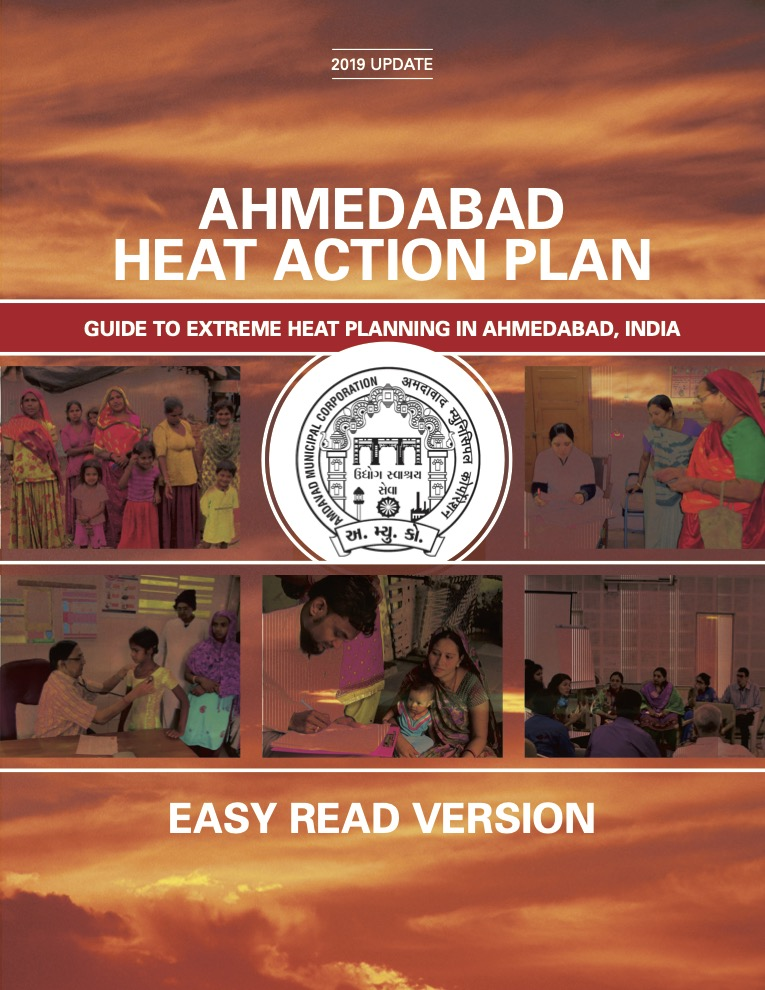
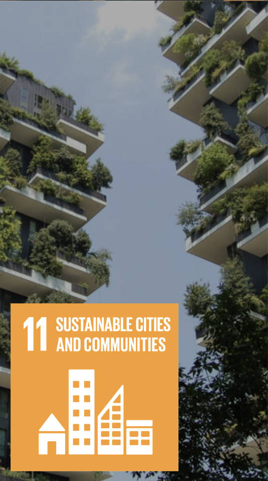

## 1. Introduction

Ahmedabad is one of India’s typical high-temperature cities and has experienced frequent extreme heat waves over the past few decades. As urbanization progresses, the increase in impervious surfaces and the reduction in green spaces have further exacerbated the urban heat island effect. After analyzing data from 2002 to 2018, [@SHARMA2024101832] found a significant association between extreme heat events and all-cause mortality. Extreme heat is no longer merely a climatic phenomenon; it poses a substantial threat to public health.

![Association between Maximum Temperature and Mortality Risk. Resource: [@SHARMA2024101832].](images/clipboard-2170059669.png){fig-align="center" width="448"}

## 2. Ahmedabad 2016 Heat Action Plan

Against this backdrop, Ahmedabad began to gradually explore systematic measures to address heatwaves, the most notable of which is the Ahmedabad Heat Action Plan. This policy is considered the first city-level heat-related health response plan in South Asia. It primarily aims to reduce the risks through early warning systems, public awareness campaigns, and interagency collaboration.

::: {style="text-align: center;"}
[{width="341"}](https://www.nrdc.org/sites/default/files/ahmedabad-heat-action-plan-2016.pdf)
:::

As the policy was implemented, attention gradually turned to its effectiveness. Research findings indicate that following the policy’s implementation, the risk of heat-related deaths has decreased [@https://doi.org/10.1155/2018/7973519].This result demonstrates that policy interventions can, to some extent, mitigate the impacts of extreme weather. This has led me to further consider whether disparities in heat risk persist across different areas within the city, and whether existing policies are capable of adequately identifying these disparities.

Current analytical methods remain primarily based on meteorological warnings and city-wide responses, with relatively limited attention paid to spatial variations within cities. Differences in vegetation cover, building density, and socioeconomic conditions across different areas all influence their sensitivity to high temperatures. Therefore, how to more precisely identify the distribution of heat risk within cities and provide support for more targeted interventions has become a topic worthy of further exploration.

## 3. Data

Given the limitations of existing Heat Action Plans in terms of spatial resolution. The incorporation of remote sensing data can help provide a better understanding of variations in heat exposure within cities. By analyzing multi-source remote sensing data, it is possible to identify which communities are more vulnerable to high temperatures. Furthermore, by combining this information with data on vegetation cover and water body distribution, we can pinpoint areas lacking natural factors that help mitigate heat stress.

The raw data for LST primarily comes from thermal infrared imagery (TIRS) captured by the Landsat-8 satellite. Surface emissivity is derived from the thermal infrared band, and surface temperature for each pixel is estimated through atmospheric correction and radiometric calibration. Some researchers have further utilized multispectral and high-resolution imagery to downscale LST to a 10-meter resolution, capturing spatial variations in the urban thermal environment[@10183518]

![Visual comparison between 30m and 10m pixel size of ahmedabad airport runway (tarmac). Resource: [@10183518]](images/clipboard-1331033014.png){fig-align="center" width="475"}

Raw NDVI data is derived from the visible and near-infrared bands of Landsat-8 or Sentinel-2. This index can be used to identify areas within cities with abundant or scarce green space, and when combined with LST data, it can be used to analyze the role of green space in mitigating high temperatures. Previous studies have also shown that vegetation and water bodies exhibit a negative correlation with surface temperature in the urban heat environment of Ahmedabad. Areas with abundant vegetation typically have lower temperatures[@s19173701].

![Pearson’s correlation between SUHII (2003–2018) and different potential drivers during daytime and nighttime, in the summer and winter season. [@s19173701]](images/clipboard-2960236245.png)

## 4. Application

As we mentioned earlier, we can now obtain Land Surface Temperature (LST) data with 10-meter resolution and detailed vegetation cover (NDVI) data. The most direct application of this is to transform these data into a high-resolution urban heat island diagnosis map. We no longer need to rely on citywide weather forecasts. Satellite imagery can provide precision down to the block or even street level, directly identifying which specific buildings and neighborhoods are currently in the furnace.

When a heat wave strikes, the government won’t have to cast a wide net across the entire city. Where should cooling centers and temporary water stations be set up? In which areas should ambulances be on standby? Simply deploy resources directly to the red zones with the highest LST readings. At the same time, heat warnings no longer need to be broadcast citywide. Instead, by combining this data, targeted alerts can be sent to high-risk communities with dense populations and poor green space coverage, reminding residents to take precautions. Furthermore, by overlaying this data with population density or socioeconomic data. We can identify areas with high heat exposure and high vulnerability, which is critical for developing more equitable policies.

::::: {#fancy-layout style="display: flex; gap: 20px; justify-content: center; align-items: flex-start;"}
::: {#first-pic style="width: 45%; text-align: center;"}
[{width="51%"}](https://sdgs.un.org/goals)
:::

::: {#second-pic style="width: 45%; text-align: center;"}
[{width="48%"}](https://sdgs.un.org/goals)
:::
:::::

From a broader perspective, optimizing heat action plans using high-resolution spatial data is a key pathway to achieving the United Nations Sustainable Development Goals. First, this directly contributes to Goal 11 (Sustainable Cities and Communities) by precisely identifying surface temperatures to determine how cities can improve infrastructure and enhance their resilience to climate-related disasters. Second, this data-driven approach helps reduce health inequalities, aligning with Goal 3 (Good Health and Well-being), and ensures that marginalized groups are not left behind during extreme heat waves due to their disadvantaged geographic locations or economic circumstances. However, as mentioned earlier, data technology must be integrated with practical socioeconomic realities to truly realize a sustainable future.

## 5. Reflections

The results derived from satellite image analysis are free from subjective bias. They enable decision-makers to quickly bypass the debate over “where resources are most needed” and move directly to the implementation phase of “how to carry out interventions.” Furthermore, since this data is inexpensive to obtain and updated rapidly, it significantly reduces the burden on field staff responsible for data collection.

However, Satellites measure surface temperatures，such as how hot a rooftop or asphalt road is. This does not equate to the air temperature or indoor temperature that residents actually experience. An area with extremely high LST and low NDVI could be a large, modern shopping mall with central air conditioning. Conversely, an urban village that appears to be surrounded by greenery may actually consist of shantytowns built with corrugated iron roofs and extremely poor ventilation, where residents are enduring deadly indoor heat. Relying solely on “red zones” on satellite imagery to allocate relief supplies can easily lead to a severe misallocation of resources.
