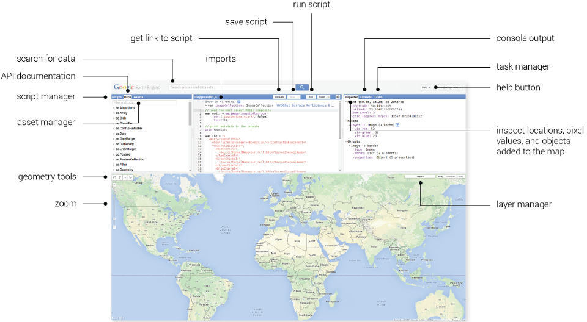

## 1. Meet Earth Google Engine

Revisiting Google Earth Engine (GEE) this week instantly brought back memories of my first encounter with this technology during my undergraduate studies. Back then, I tried using GEE to analyze urban expansion, and what impressed me most was how convenient it was. Unlike traditional remote sensing, there was no need to painstakingly search for data on official websites, endure lengthy download processes, or consume vast amounts of local storage. With just a few lines of simple code, I could directly access massive historical datasets in the cloud for analysis and instantly render the results in an intuitive, interactive world map below the editor. It shattered my preconceived notion that remote sensing software had to process data locally.

