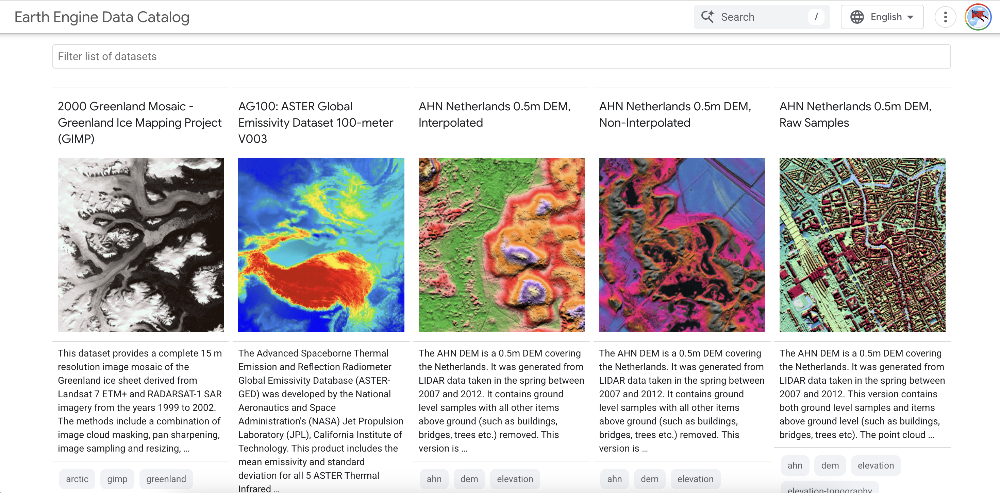
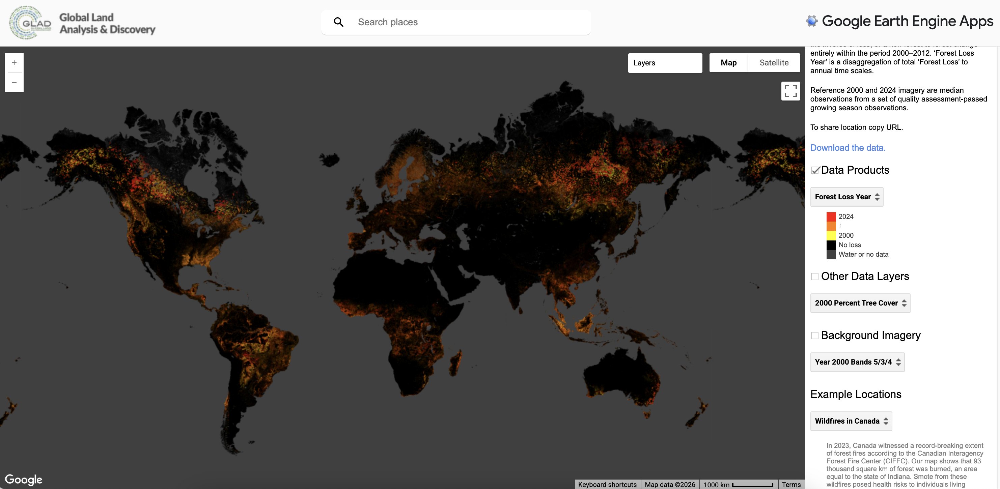

## Introduction

Revisiting Google Earth Engine (GEE) this week instantly brought back memories of my first encounter with this technology during my undergraduate studies. Back then, I tried using GEE to analyze urban expansion, and what impressed me most was how convenient it was. Unlike traditional remote sensing, there was no need to search for data on official websites, endure lengthy download processes, or consume vast amounts of local storage. With just a few lines of simple code, I could directly access massive historical datasets in the cloud for analysis and instantly render the results in an intuitive, interactive world map below the editor. It shattered my preconceived notion that remote sensing software had to process data locally.

My favorite part is Google Earth Engine’s Data Catalog. Essentially, it’s GEE’s official data repository. Basically, it brings together a wide variety of geospatial data from the 1970s to the present, including the widely used Landsat and Sentinel satellite imagery, as well as ready-to-use products such as temperature, precipitation, and land cover classifications.

It is closely integrated with GEE’s actual workflow. After searching for and selecting a dataset on the Catalog page, you can directly access the raw data in the cloud for analysis without needing to download any files yourself. It acts like an online manual, helping you look up band parameters and view the data’s temporal coverage, and allowing you to jump directly to the programming interface with a single click to get started.

## Application

One aspect I found particularly interesting during my studies was the GEE App. Unlike simply writing code to perform analyses, GEE allows you to turn the entire analysis process into an interactive web application, enabling users to view results through a simple interface without needing to understand the code itself.

I’ve looked at some existing GEE apps. One that left a particularly strong impression on me is the Global Forest Change app, which is primarily used to visualize changes in forest cover and deforestation on a global scale. It presents what are typically complex remote sensing analysis results in a very intuitive way—for example, using red to indicate forest loss and green to indicate existing forests—so that even users without prior background knowledge can quickly understand the data. Additionally, it makes excellent use of time-series data, allowing users to view changes over multiple years rather than just at a single point in time.

If you’d like to learn more, watch the video below for a clearer understanding of the GEE App’s design and applications.



## Reflection

To be honest, after working with GEE this week, my biggest takeaway is that I probably never want to go back to the old way of working with traditional software like ArcGIS or ENVI. With those traditional software tools, I had to remember complicated steps every time I ran a process. Clicking the right icon, entering the correct parameters. If you clicked the wrong button or wanted to change a parameter, you’d almost have to start from scratch. Writing code in GEE might be a bit overwhelming at first, but it’s truly ideal for processing large volumes of files, and you can open and run it directly later on. I can modify any step in the workflow, and the entire process is crystal clear and fully reproducible.

However, GEE is definitely not perfect, and I’ve run into a few frustrating hurdles in the past.

-   The computational performance isn't very strong. As soon as you try to process images that are slightly larger or have higher resolution, the progress bar moves extremely slowly. I often find myself staring at the screen for ages, only to end up with a “Computation timed out” error.

-   Its preprocessing workflow is somewhat of a “black box.” While it’s convenient to receive fully processed data, this also means we lose the ability to choose different preprocessing methods (such as atmospheric correction or terrain correction algorithms).

-   What frustrates me the most is its debugging mechanism. In RStudio or VS Code, we can test code in blocks, but with GEE, you almost always have to run the entire script from start to finish. If an error occurs midway through, it’s difficult to determine whether the problem lies in the code logic or if the cloud server itself has stalled. I find this approach extremely time-consuming.
