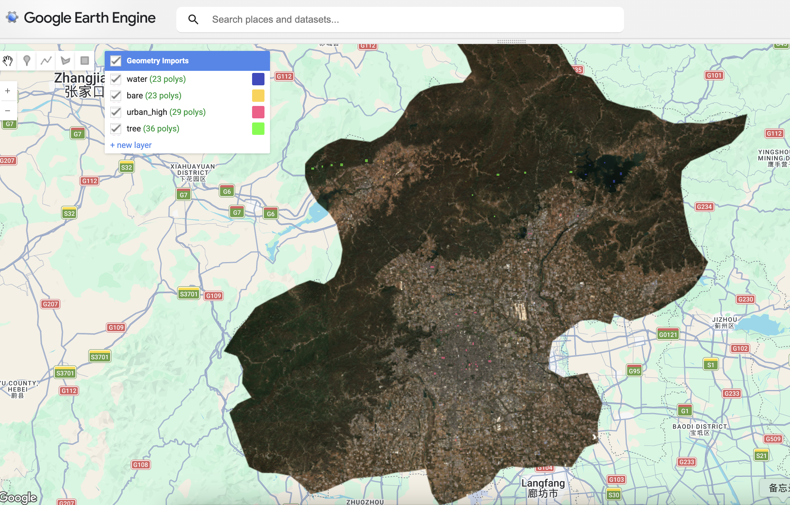
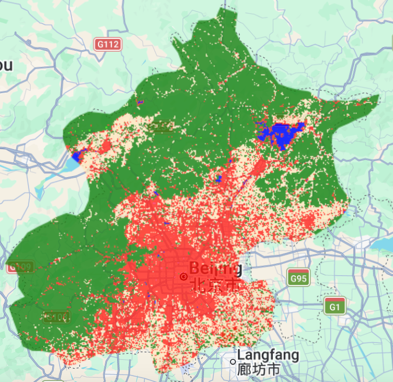
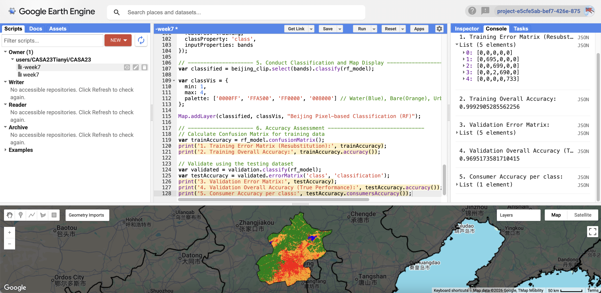

## Summary

After learning the basics of GEE last week, this week’s topic is classification using machine learning. I realized that the “classification” tools I used to work with in ENVI or ArcGIS were actually based on supervised learning. In our introductory courses, we simply referred to them as “image classification.” It wasn’t until this week that I truly understood the logic behind these tools.

Why do we perform image classification? Satellite image data consists of nothing more than pixels with numerical values. Our goal is to transform these meaningless numbers into “semantic information” that humans can understand, such as identifying where buildings are located and where bodies of water are found. We use remote sensing techniques to quantify urban sprawl, deforestation, and environmental changes.

The core of image classification lies in the use of spectral signatures. Different land features exhibit vastly different reflectance across different spectral bands. The classifier’s task is to learn the patterns of these spectral characteristics by analyzing the training samples we provide.Then, automatically classify the pixels across the entire map.

| Aspect | CART | Random Forest | Naive Bayes | SVM |
|:---|:---|:---|:---|:---|
| Core Idea | Recursive splitting | Ensemble voting | Probabilistic model | Max margin separation |
| Overfitting | High | Low | Low | Medium |
| Training Speed | Fast | Medium | Very fast | Slow |
| Interpretability | High | Low | Medium | Low |
| Best Use Cases | Simple rules | General tasks | Text classification | High-dim data |

Since Xinjiang in China encompasses a wide variety of landforms. I initially worked with a Level 1 region. However, GEE quickly froze and returned an error due to the massive computational load. So I promptly narrowed the scope down to Beijing. I used the QA60(specifically records whether each pixel is covered by opaque clouds or cirrus clouds.) band to remove areas with cloud cover and calculated the median of the remaining images for the year, resulting in a clean base map.

I don’t have a large number of sample areas, so to improve classification accuracy, I generated 1,000 random points within each ground-truth patch. This helps prevent overfitting caused by a lack of diversity in the samples.

{fig-align="center" width="489"}

I selected a total of nine bands, specifically including the two short-wave infrared bands, B11 and B12. These are particularly effective for distinguishing between urban buildings in Beijing and the surrounding hillsides and wasteland[@su172210324].

During the experiment, I ran two algorithms: CART and Random Forest.

{fig-align="center" width="374"}

**Random Forest** is known for its stability. To properly validate the model, I kept 30% of the data hidden during training to use for a final test. The results were actually quite good, with a validation accuracy of 0.969. The final confusion matrix shows that the classification accuracy for water and forest is nearly perfect, while the primary minor errors are concentrated between urban and bare land. This is because, in the suburbs of Beijing, the spectral characteristics of certain building materials are highly similar to those of soil.

## Applications

Existing research generally indicates that Random Forests typically outperform CART in terms of classification accuracy and model stability. For example, [@su172210324] shows that the overall accuracy of Random Forests can reach 0.96–0.98, whereas CART’s accuracy is relatively lower and more volatile.

This difference in performance can be attributed to differences in model architecture. CART is a single decision tree model that is susceptible to the training data and prone to overfitting[@breiman1984classification]. In contrast, Random Forests effectively reduce model variance by aggregating the predictions of multiple decision trees through voting, resulting in high generalization ability[@Breiman2001RandomF].

However, it is important to note that CART is not totally inferior to Random Forests. If the data structure is relatively simple or the differences between classes are distinct, CART can still achieve good classification results. Furthermore, CART offers good interpretability and retains an advantage in certain application scenarios where an explanation of the model’s decision-making process is required.

Although the Random Forest algorithm was first proposed as early as 2001 and has undergone more than two decades of development, what changes and improvements have been made?

![Land cover map across the Victoria state at 20m spatial resolution for 2021/22.[@Sabaghy2025]](images/clipboard-635645688.png){fig-align="center" width="573"}

The increasing accessibility of high-resolution Sentinel-2 and UAV imagery has shifted the research focus toward finer-scale features and intricate land cover types. Rather than relying solely on spectral data, modern approaches now integrate multiple sources—including textural and topographic information—while optimizing parameters to boost both accuracy and model stability. Consequently, the field has evolved from broad macro-scale mapping in agriculture to specialized applications like urban land-use classification[@Sabaghy2025], wetland conservation, and real-time disaster monitoring.

## Reflection

In this week’s training, the number of hand-drawn polygons was limited, with only about a dozen for each category, making it difficult for the model to fully learn the spectral characteristics of objects. Although pixel-level random sampling increased the sample size and improved model accuracy, it may have led to a concentration of training samples in certain areas, failing to fully reflect regional heterogeneity. In the future, we may consider more uniform or stratified sampling.

During the classification process, spectral similarities between buildings and bare ground led to some confusion, highlighting the limitations of relying solely on spectral bands for classification. In the future, category discrimination could be improved by incorporating texture features or the Normalized Difference Building Index (NDBI). In complex urban environments, spectral information may not be sufficient to resolve all classification challenges; therefore, future research should explore methods that combine spatial structural features with multi-temporal data.

While reviewing the literature, I noticed a cutting-edge trend of combining random forests with predictive models. For example, the paper “Simulation of Wetland Changes in the Wuhan Urban Agglomeration Based on the Integration of Random Forests and the CLUE-S Model” demonstrates how to use machine learning to extract features and couple them with spatial models for multi-scenario simulations[@PENG2020106671]. This gives me a new idea: I could use the current Beijing classification as baseline, add models like CLUE-S or CA-Markov, and combine population and traffic data to simulate future land cover changes.
