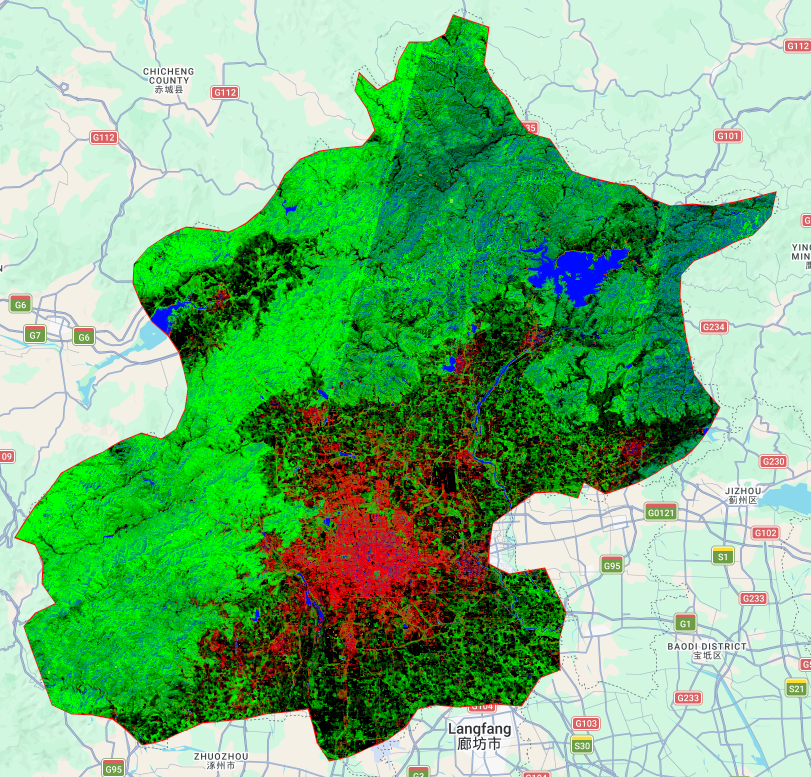
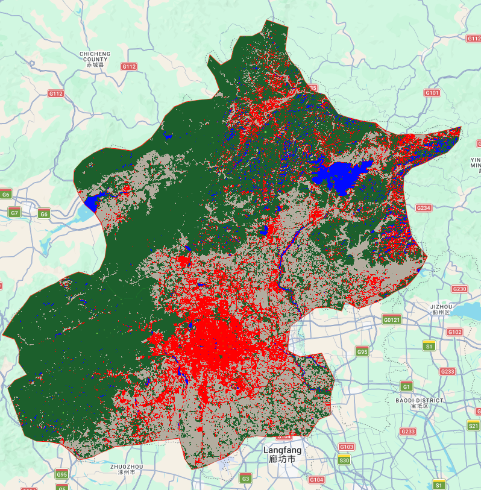
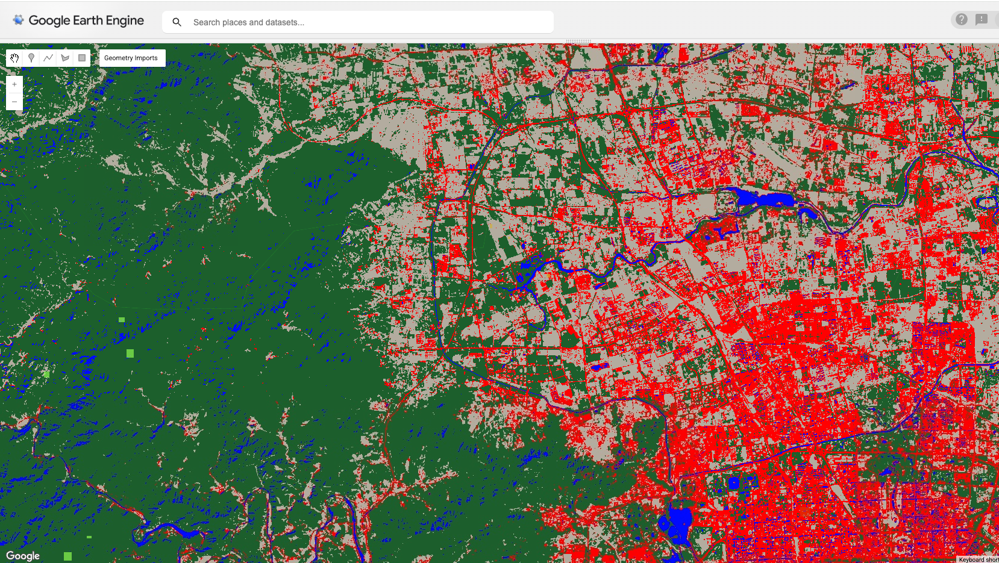
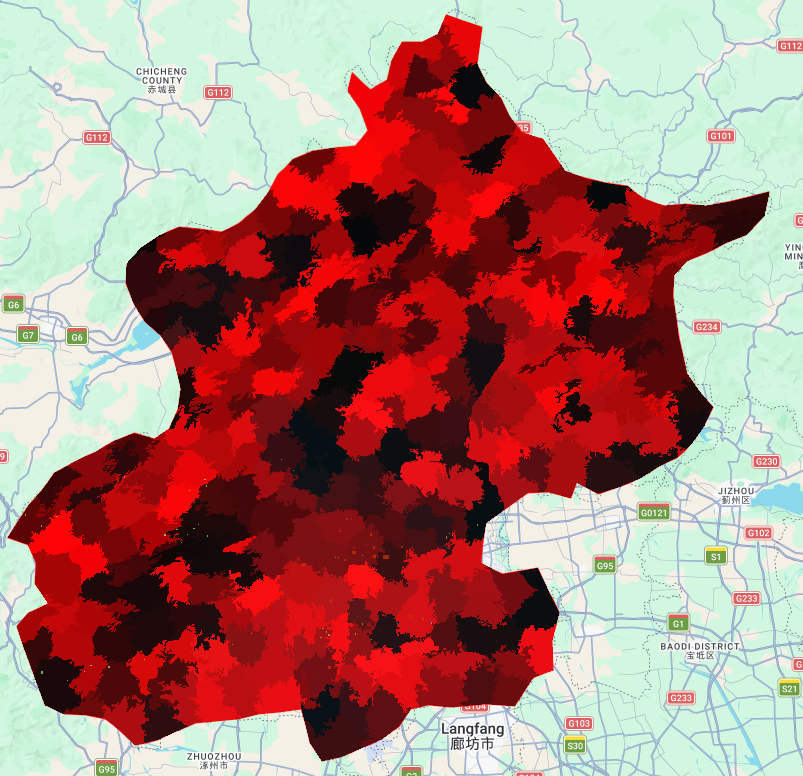
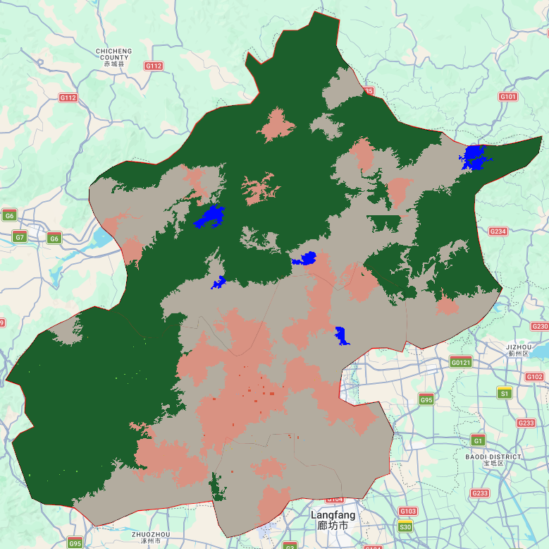

## Summary

This week marks a transition from basic pixel-based classification towards more advanced approaches in remote sensing, prompting me to rethink the role of the pixel as the fundamental spatial unit. In previous weeks, classification methods largely followed a simplified assumption that each pixel can be assigned to a single, discrete land cover class. While this “black-and-white” approach is methodologically straightforward, it becomes increasingly problematic in complex urban environments, often leading to biased area estimates.

This week, we explored two advanced approaches for handling complex ground-level environments:

-   **Sub-pixel unmixing**, which introduces the concept of “gray zones” to account for spectral mixing within pixels and calculate component ratios.

-   **Object-based image analysis**, which breaks down the isolation of pixels in the spatial dimension by aggregating adjacent pixels into “superpixel” objects with shape and texture. This shift from “single labels” to “component ratios” and “spatially semantic objects”.

The preprocessing stage already required contextual adjustment. Using Landsat 8 (L2) imagery, I relaxed the cloud filtering threshold from 1% to 5% to account for Beijing’s atmospheric conditions, followed by cloud masking and median compositing. This highlighted an early trade-off between data quality and data availability, which inevitably influences the reliability of downstream classification results.

### Sub-pixel Analysis

Using the sub-pixel approach gives us a much more flexible way to look at Beijing's mixed-up urban surface. Basically, we set up some basic categories, like buildings, water, bare dirt, and trees. Then, instead of just slapping a single label on a pixel, the model figures out the exact percentage of each thing inside it.

::::: {#fancy-layout style="display: flex; gap: 20px; justify-content: center; align-items: flex-start;"}
::: {#first-pic style="width: 45%; text-align: center;"}
{width="100%"}
:::

::: {#second-pic style="width: 45%; text-align: center;"}
{width="93%"}
:::
:::::

But there's a catch: to actually make sense of the final map and check its accuracy, we have to force those percentages into fixed, single categories. And that's its biggest downside. Even though the percentage idea is way closer to real life, a lot of those subtle details get totally lost the moment we force them into strict boxes.

{fig-align="center"}

### Object-based Image Analysis

The OBIA method makes things look more connected by grouping pixels into bigger chunks and looking at their texture. Sure, this cleans up the noise and makes the edges sharper, but in my case, the chunks ended up a bit too clunky. They formed big blocks that hid a lot of the smaller details. This just goes to show that OBIA is super picky about its settings (like how big or tight the chunks are). If you don't tweak it just right, it struggles to catch the fine details you need for a complicated city like Beijing.

::::: {style="display: flex; gap: 20px; justify-content: center; align-items: flex-start;"}
::: {style="width: 45%; text-align: center;"}
{width="100%"}
:::

::: {style="width: 45%; text-align: center;"}
{width="93%"}
:::
:::::

## Application

Traditional single-label classification often struggles with medium-resolution imagery, for example, Landsat. However, studies like [@WU2004480] ingeniously applied sub-pixel unmixing via the vegetation–impervious surface–soil (V–I–S) model model. By quantifying the proportions of these components within each pixel, this technique effectively addresses the "gray zone" problem in highly mixed urban centers, providing precise abundance indicators for macro-level urban expansion and heat island assessments.

However, as very high-resolution imagery becomes more common, the main challenge shifts from mixed pixels to the “salt-and-pepper” effect. [@MYINT20111145]show that object-based methods can handle this problem much more effectively. By grouping neighbouring pixels into larger areas with similar patterns, this approach can distinguish between surfaces that look similar in colour but differ in structure, like separating textured building roofs from smoother concrete spaces.

![A flow chart demonstrating the overall procedure to generate a final output.[@MYINT20111145]](images/clipboard-1169381459.png){fig-align="center" width="573"}

Although both methods are widely used in the literature, they still have clear limitations. Sub-pixel approaches can provide detailed proportions of different land cover types, but they lose information about how these elements are actually arranged within a pixel. For example, a pixel showing 50% vegetation does not reveal whether this represents a single large green space or many small, scattered trees, which limits its usefulness for practical decision making.

On the other hand, object-based methods depend heavily on how the segmentation is set up, which is often based on the researcher’s own judgement (Blaschke, 2010). When applied to highly varied environments across larger areas, this approach can require repeated adjustment of parameters. It is time consuming and difficult to apply consistently at scale.

![Architecture of the generative and discriminative networks of the GAN-SRM.[@9195742]](images/clipboard-1946780496.png){fig-align="center" width="646"}

Recent studies have begun to move beyond simply estimating land cover proportions by introducing deep learning approaches for higher-resolution mapping. For example, [@9195742] applies a generative adversarial network (GAN) to produce fine-scale land cover maps from coarse imagery. Instead of only providing percentage information within each pixel, this method generates a more detailed spatial pattern, making the results more visually realistic and easier to interpret.

## Reflection

While examining the intermediate SNIC outputs and the sub-pixel proportion maps, I noticed that striping effects from Landsat scene boundaries were quite visible. Reflecting on this, it seems that both methods are highly sensitive to absolute spectral values, which means that atmospheric differences between images from different dates or orbital paths can be unintentionally amplified.

In addition, the relatively small number of training samples I used around 20 polygons per class, may limited the model’s ability to capture more subtle variations in land cover. This suggests that, beyond the choice of method or segmentation approach, the quality and diversity of training data play a crucial role in determining the final results. A more comprehensive and representative training dataset would likely improve the model’s performance, especially in complex urban environments.

In short, choosing the right method involves trade-offs between detail and spatial coherence, and the optimal choice may vary depending on the complexity of the urban environment and the scale of the mapping project.
