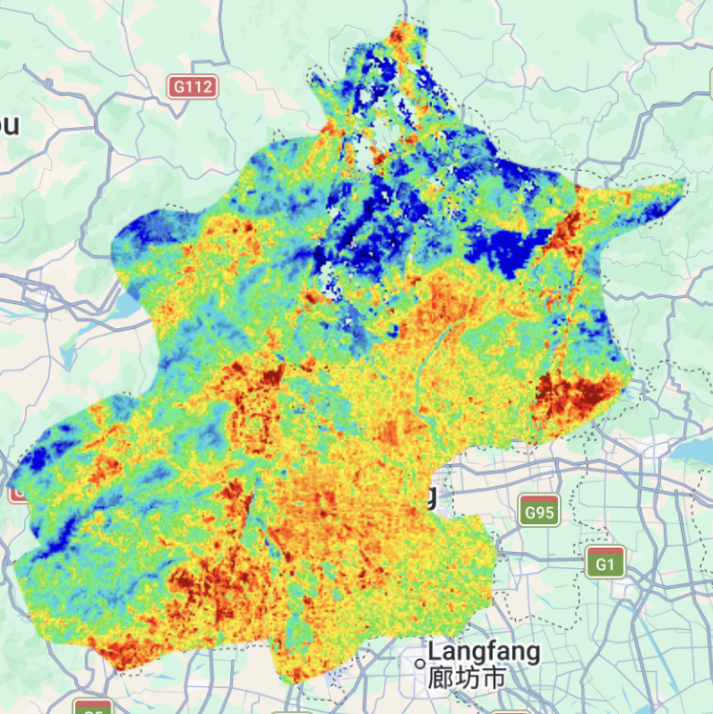
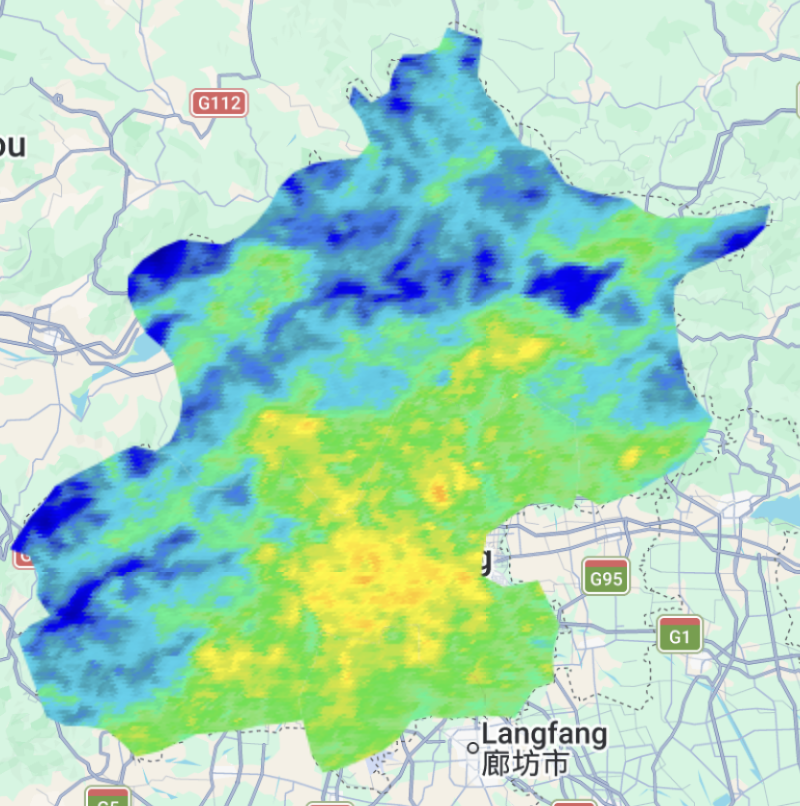

## Summary

This week focused on understanding land surface temperature (LST) derived from remote sensing data. A key takeaway is that satellites such as Landsat can measure emitted radiation from the Earth’s surface, which can then be converted into temperature using radiative transfer equations. The process involves several steps including converting digital numbers (DN) to radiance, then to brightness temperature, and finally adjusting for emissivity to obtain land surface temperature.

::::: {#fancy-layout style="display: flex; gap: 20px; justify-content: center; align-items: flex-start;"}
::: {#first-pic style="width: 45%; text-align: center;"}
{width="100%"}
:::

::: {#second-pic style="width: 45%; text-align: center;"}
{width="99%"}
:::
:::::

**Comparison of Key Satellite Sensors for Land Surface Temperature**

+-------------------------+--------------------+------------------------+------------------------------------------------------------------------------------------------------------+
| Satellite / Sensor Name | Spatial Resolution | Temporal Resolution    | Key Features & Applications                                                                                |
+:========================+:===================+:=======================+:===========================================================================================================+
| **Landsat 8/9 (TIRS)**  | 100m               | 16 days                | **Features:** High spatial detail, but lower chance of cloud-free images.                                  |
|                         |                    |                        |                                                                                                            |
|                         |                    |                        | **Applications:** Neighborhood-scale UHI assessment, microclimate & green space cooling effects.           |
+-------------------------+--------------------+------------------------+------------------------------------------------------------------------------------------------------------+
| **Terra/Aqua (MODIS)**  | 1000m              | 1-2 times/day          | **Features:** High observation frequency, ideal for time-series, but coarse spatial detail.                |
|                         |                    |                        |                                                                                                            |
|                         |                    |                        | **Applications:** Large-scale, long-term LST monitoring, extreme heatwave warnings.                        |
+-------------------------+--------------------+------------------------+------------------------------------------------------------------------------------------------------------+
| **Suomi NPP (VIIRS)**   | 750m               | At least 1-2 times/day | **Features:** Next-gen replacement for MODIS, wider swath, excellent radiometric calibration.              |
|                         |                    |                        |                                                                                                            |
|                         |                    |                        | **Applications:** Regional thermal environment monitoring, urban composite analysis with nighttime lights. |
+-------------------------+--------------------+------------------------+------------------------------------------------------------------------------------------------------------+
| **Sentinel-3 (SLSTR)**  | 1000m              | \< 1 day               | **Features:** Unique dual-view observation, highly accurate LST retrieval.                                 |
|                         |                    |                        |                                                                                                            |
|                         |                    |                        | **Applications:** Large-scale climate modeling, high-precision regional thermal dynamics.                  |
+-------------------------+--------------------+------------------------+------------------------------------------------------------------------------------------------------------+
| **Terra (ASTER)**       | 90m                | 16 days                | **Features:** Extreme spatial resolution, but non-continuous global imaging.                               |
|                         |                    |                        |                                                                                                            |
|                         |                    |                        | **Applications:** High-precision historical LST retrieval for specific small areas.                        |
+-------------------------+--------------------+------------------------+------------------------------------------------------------------------------------------------------------+

Most LST studies rely on Landsat imagery, especially Landsat 5 and 8, and tend to focus on semi-arid, tropical, and temperate regions. In polar areas, where cloud cover is frequent, researchers often use MODIS for its wider coverage and higher temporal resolution[@MOHAMED2025100315].

[![The Sankey diagram shows the relationship between countries, climate zones, and satellite sensors used in Land Surface Temperature (LST) and Land Use Land Cover (LULC) studies.[@NASERIKIA2023167306]](images/clipboard-3929050240.png){fig-align="center" width="617"}](https://www.sciencedirect.com/science/article/pii/S2666049025000386)

## Application

A lot of the literature this week focused on using LST to understand urban heat patterns, especially the Urban Heat Island effect. More recent studies seem to emphasise how strongly land use change affects temperature. There are broader reviews suggesting that urbanisation itself is one of the main drivers of increasing surface temperatures globally[@MOHAMED2025100315]. However, despite strong spatial correlations, these studies still rely on surface temperature rather than air temperature, which may limit their direct applicability to human thermal comfort[@NASERIKIA2023167306]. Human thermal comfort depends on multiple factors such as air temperature, humidity and radiation, and LST is not a direct measure of it.

[![The temperature difference between LST and Ta on acquisition dates in Netatmo stations across Sydney.[@NASERIKIA2023167306]](images/clipboard-3801461519.png){fig-align="center" width="617"}](https://www.sciencedirect.com/science/article/pii/S0048969723059338)

Recent studies have extended this approach by linking LST with social and spatial inequalities. In Chicago, high-resolution downscaled LST data revealed significant differences in heat exposure across ethnic and socioeconomically diverse communities, showing that urban heat does not affect all residents equally[@rs16091639]. Similarly, a spatial regression analysis across four major East Asian cities demonstrated that land use composition and metropolitan structure strongly influence LST distribution, emphasizing the role of urban planning in shaping thermal environments[@li2022modeling]. In conclusion, this shifts LST from being purely a physical measurement to a tool for understanding environmental justice issues.

[![Ethnic map of Humboldt Park region.[@rs16091639]](images/clipboard-3112875906.png){fig-align="center" width="617"}](https://www.mdpi.com/2072-4292/16/9/1639)

## Reflection

This week’s content really opened my eyes. It did a great job connecting abstract remote sensing data with real-world social issues. Looking at these skills in the bigger context of urban planning, I not only learned how to process temperature data and do zonal statistics in GEE, but also started to see how remote sensing can actually be used as a powerful tool to measure social inequality and support more sustainable city planning.

For what comes next, since we can already use MODIS to track time-series data and calculate average heat risk in specific areas, I think a really interesting direction would be to combine dynamic LST data with more detailed census data. That kind of spatial overlay could help us better understand social vulnerability. And if we bring in methods like geographically weighted regression, we could even figure out how different environmental and social factors contribute to local temperature differences. That would make it easier to design more targeted strategies for climate adaptation.
